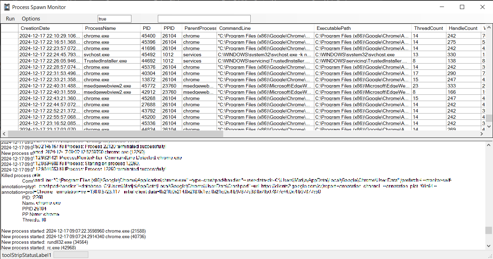
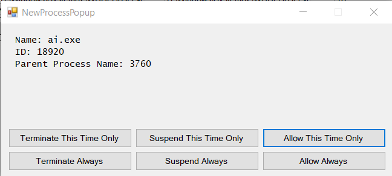
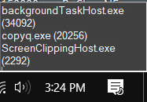
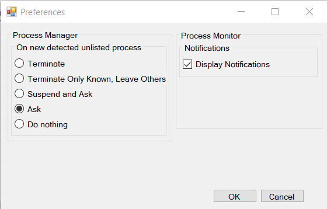

# Process Spawn Monitor
Program that monitors creation of new processes with option to suspend or kill undesired processes.

## Usage
Main functionality is checking new processes and making decisions based on your rules. Main Rules are:
* Terminate -> Terminates every new process. Use only in test environment if you expect malware.
* Suspend -> When app is suspended you are asked wheather to kill it or allow it.
* Ask -> You are asked for every new process. At first you will have many prompts that will be saved to ini file.
* Do nothing (Ignore)

Additional functionality:
* See information about new process (PID, PPID, Command line, Executable path, ...) with right mouse click on process in grid.
* Display notifications about new process on bottom right side of the screen.
* Open path of executable.

### :: ProcessSpawnMonitor.ini -> ExampleSettings
1. Here are stored rules. Program autimatically stores them based on your decision when popup message about new process is displayed.
2. ShellCommands contain some usefull commands you can store and use.

```ini
[KnownProcessList]
System = DoNothing
xyzUpdater.exe = Terminate

[ToBeKilledProcessesContainingCommandLines]
001 = crashpad

[ShellCommands]
101 = netstat -an
102 = netstat -n -o -b
```


## External Dependencies

* IniFileParser
[https://github.com/SoftCircuits/IniFileParser](https://github.com/SoftCircuits/IniFileParser)

* WinDivert
[https://github.com/basil00/WinDivert](https://github.com/basil00/WinDivert)


## Screenshots









